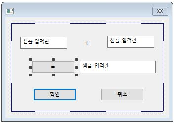
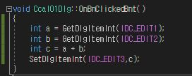
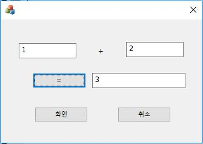

# 덧셈 계산기 만들기 - 01
1. 도구 상자에서 Edit Control(3개), Button(1개), Static Text(1개) 를 선택해서 아래와 같이 배치해준다
  
* 여기서 Edit Control의 속성에서 ID를 E1,E2,E3 로 바꿔준다
* Static Text의 속성에서 Caption을 +로 바꿔준다.
* Button 의 속성에서 Caption을 =으로 바꿔주고 ID를 Bnt로 바꿔준다.   그리고 더블 클릭을 하면 아래와 같이 함수가 나타날 것이다.  
2. Button을 더블 클릭한 후 나타난 함수에 아래와 같이 쳐준다.  

3. 그 후 Ctrl+S를 한 후에 F5를 눌러주면 실행이 아래와 같이 실행이 된다.  

