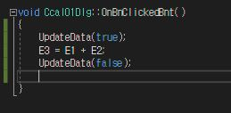

# 덧셈 계산기 만들기 02
* 덧셈 계산기 만들기 01의 다음 단계이다.  
1. 앞서 만든 3개의 Edit Control 중 하나를 선택하여 우클릭 후 변수 추가를 누른다.

* 계산기를 만들기 때문에 범주를 값으로 설정해주고 이름을 E1으로 설정해준다.
* 변수 형식은 int로 선언해주고 마침을 누른다.
* 남은 2개의 Edit Control도 이름을 제외하고는 똑같이 변수 추가를 해주면 된다.  
2. 아래와 같이 코딩을 해준다.
  

* UpdateData(true) 는 컨트롤 값을 변수로 전송
* UpdateData(false) 는 변수를 컨트롤로 전송
* 여기서 컨트롤은 Edit Control에 입력되는 데이터이다.
3. 마찬가지로 F5를 누르면 아래와 같이 실행이 된다.
  

