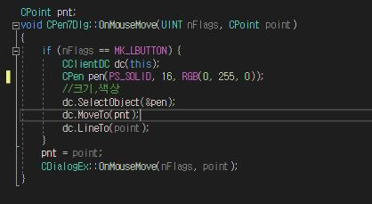
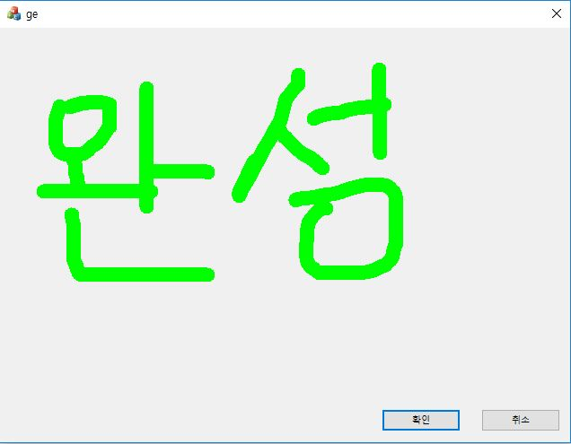

# 다이얼로그 기반의 펜
### 시작은 howtostart.md를 참조해주길 바람  
  
1. 기본 화면에서 속성의 메시지를 클릭하여 아래로 내리면 WM_MOUSEMOVE 가 있다.  
이것을 OnMouseMove로 바꿔주면 그에 해당하는 함수를 작성할 수 있게 뜰것이다.  

  
2. 아래와 같이 코드 작성

* CPoint pnt;를 함수 밖에 선언해주어야 한다.
* if 문은 MK_LBUTTON이 되었을 때 실행된다. 즉, 마우스의 왼쪽 버튼이 클릭 되었을 때 실행된다.
* CCllientDC는 클라이언트 영역에 출력할 때 사용
* CPen pen(PS_SOLID, 16, RGB(0,255,0));은 16pt 크기의 초록색 펜이 나올 것이다.
* MoveTo는 움직임을 따라가는 것이고 LineTo는 클릭된 순간부터 그려지는 것이다.

3. 완성

